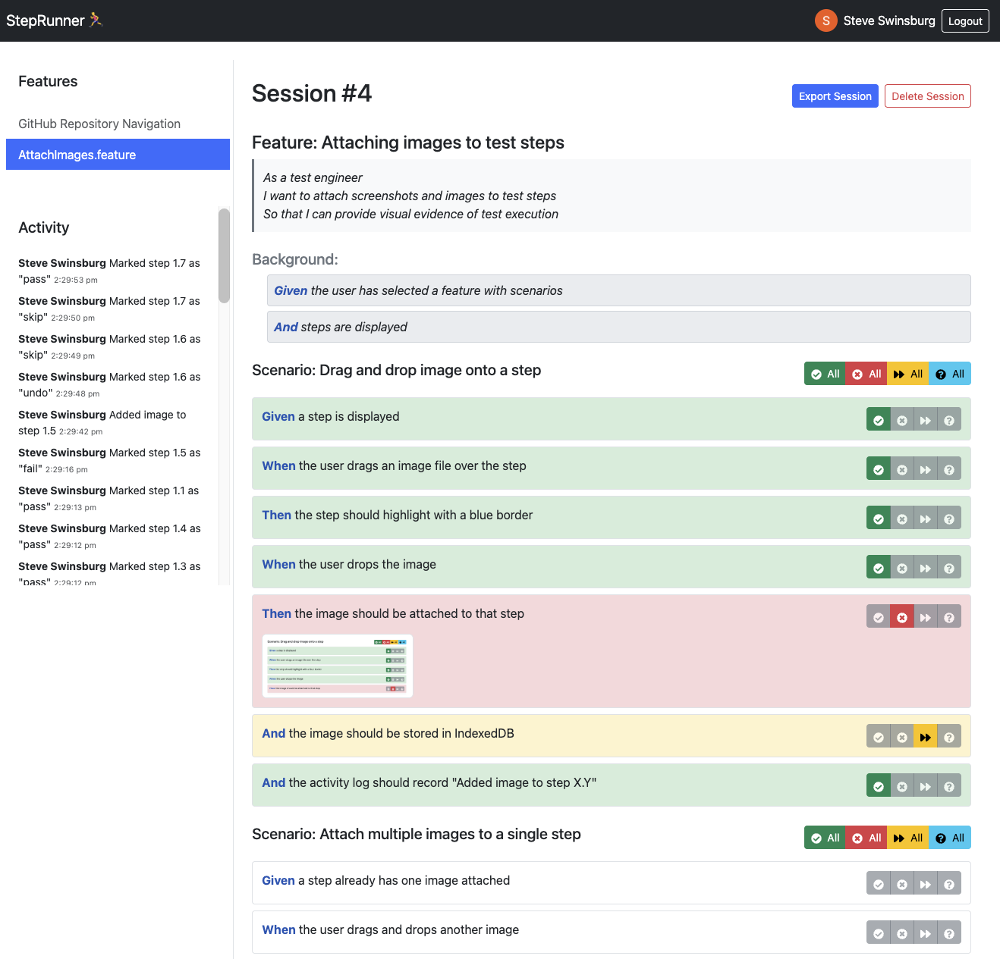

# 🏃‍♂️ StepRunner

[](https://github.com/steveswinsburg/steprunner/actions/workflows/node.js.yml)
[](https://github.com/steveswinsburg/steprunner/actions/workflows/firebase-hosting-merge.yml)
[](LICENSE)

🌐 **Live Demo:** https://steprunner-abc1f.web.app/

**StepRunner bridges the gap between automated and manual testing by seamlessly blending both approaches.** Perfect for QA engineers, testers, and developers who need to execute BDD scenarios step-by-step, import existing Cucumber automation results, attach visual evidence, and generate unified reports that combine automated test outcomes with manual verification.

## ✨ Key Features

- 📂 **File Upload**: Support for `.feature` files and Cucumber JSON reports
- 🧾 **Smart Display**: Beautiful rendering of features, scenarios, steps, backgrounds, and examples
- ✅ **Interactive Execution**: Mark steps as passed/failed/skipped/undefined individually or in bulk
- 📸 **Visual Evidence**: Drag-and-drop image attachments for any step
- 📊 **Rich Reporting**: Export results as Cucumber JSON and browsable HTML reports
- 🔄 **Hybrid Workflows**: Import automated results and continue with manual steps
- 🔒 **Privacy-First**: No data leaves your browser unless you choose to export
- 🎨 **Intuitive UI**: Clean, modern interface designed for testing workflows
- 📱 **Mobile Friendly**: Works seamlessly on desktop, tablet, and mobile devices

## 📸 Screenshots & Demo



*StepRunner interface showing step-by-step execution of a Cucumber feature file with visual feedback*

## 🧠 How It Works

1. **Upload**: Start a new session and upload `.feature` files or a `cucumber-report.json`
2. **Browse**: Navigate through features, scenarios, and steps via the intuitive UI
3. **Execute**: Mark steps as passed/failed/skipped as you execute tests manually
4. **Document**: Drag and drop screenshots onto steps for visual evidence
5. **Export**: Generate comprehensive JSON and HTML reports for sharing

## 🚀 Getting Started

### Prerequisites

- Node.js (>= 18)
- npm

### Installation & Development

```bash
# Clone the repository
git clone https://github.com/steveswinsburg/steprunner.git
cd steprunner

# Install dependencies
npm install

# Start development server
npm start

# Open http://localhost:3000 in your browser
```

## 🤝 Contributing

See [CONTRIBUTING.md](CONTRIBUTING.md)

## 📄 License

This project is licensed under the MIT License - see the [LICENSE](LICENSE) file for details.

**Made with ❤️ for the testing community**
