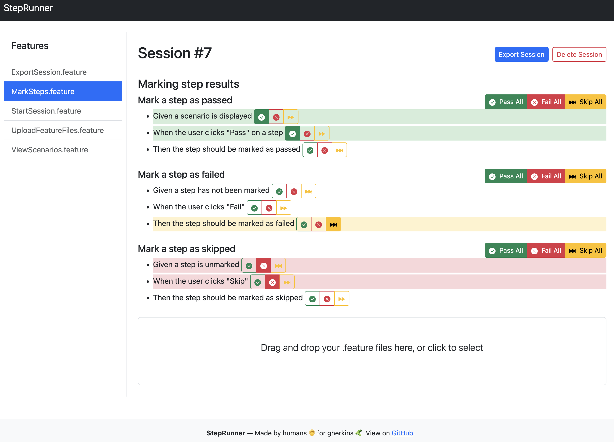

# 🏃‍♂️ StepRunner

**A viewer and runner for Cucumber/Gherkin feature files**

StepRunner is an app for exploring and running `.feature` files manually. Upload feature files or Cucumber JSON reports, execute tests step-by-step, attach screenshots, and export results as browsable HTML reports. Ideal for exploratory testing, documentation walkthroughs, or scenarios not ready for automation.

https://steprunner-abc1f.web.app/

[](https://github.com/steveswinsburg/steprunner/actions/workflows/node.js.yml)
[](https://github.com/steveswinsburg/steprunner/actions/workflows/firebase-hosting-merge.yml)

## 🚀 Features

- 📂 Upload `.feature` files or Cucumber JSON reports
- 🧾 Display features, scenarios, and steps with descriptions and backgrounds
- ✅ Mark steps as passed/failed/skipped/undefined individually or in bulk
- � Attach images to steps via drag-and-drop
- � Export as Cucumber JSON and HTML reports

## 📸 Screenshot



## 🧠 How It Works
1. Start a new session and upload `.feature` files or a `cucumber-report.json`
2. Browse scenarios and steps via the UI
3. Mark steps as passed/failed/skipped as you execute tests
4. Drag and drop screenshots onto steps for visual evidence
5. Export your test session as JSON and HTML reports

### 🔄 Hybrid Testing: Automated + Manual

Got automated tests but some scenarios that need manual verification? StepRunner bridges the gap:
- Import your Cucumber JSON report with automated test results already marked
- Continue with manual steps that weren't automated
- Drag and drop screenshots for manual verification
- Export a complete report combining both automated and manual execution


## 📦 Getting Started

### Prerequisites

- Node.js (>= 18)
- npm

## 🤝 Contributing

Contributions are welcome! If you have suggestions, ideas, or bug reports:
1. Fork the repo
2. Create a feature branch
3. Submit a pull request

## 🤓 Developers

```
npm install
npm start
```
Then open `http://localhost:3000` in your browser.
